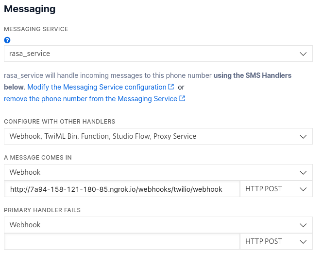
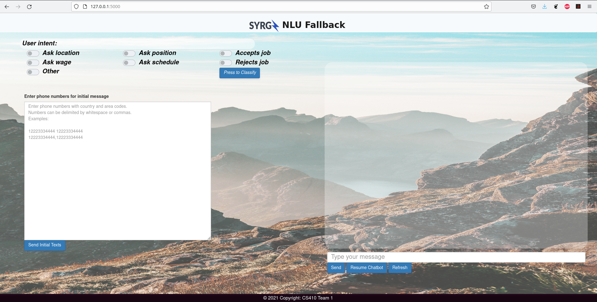
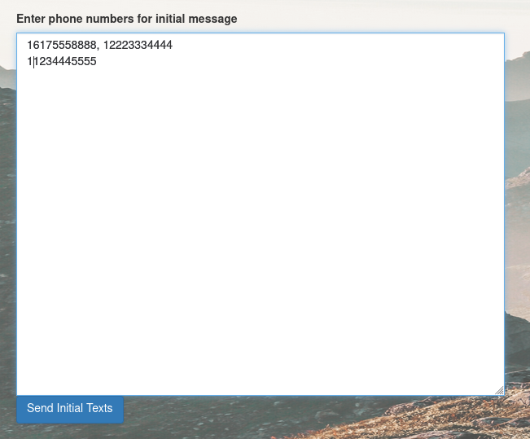
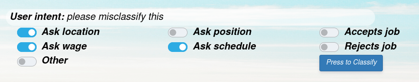
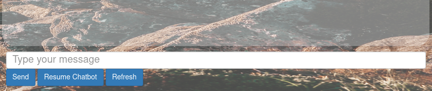

# rasa-proj

## SETUP
install rasa  
run "rasa init" in a directory  
copy all of the rasa-proj files into that directory overwriting duplicates  
now run "rasa train" from that directory

## TASKS NEEDED TO RUN LOCALLY FOR TESTING SITE  
ngrok http 5005  
rasa run --enable-api --cors "*"  
rasa run actions  
python3 app.py  

## SETUP TWILLIO   
go to Phone Numbers -> Manage -> Active numbers  
if you have an active number click on it and scroll down to Messaging  
in the "A Message Comes In" box, enter the ngrok forwarding address + /webhooks/twilio/webhook as a HTTP POST  
  

## SITE USAGE
After typing http://127.0.0.1:5000/ into your browser, this page should show.  
  
Upon site start the Refresh button must be pressed to initialize busy waiting for user input.

If would would like to send the opening message to any number of numbers, paste the numbers in the text box in the bottom left and press "Send Initial Texts"  

If you would like to classify a user input, select any boxes in the upper left and press "Press to Classify" to write the classification to a file named new_data.csv and then an appropriate message will be sent to the user.  
  

In order to pass back control from the webpage to the rasa classifier, press "Resume Chatbot"  
Otherwise if you want to send off a message to the user, type a message and press "Send"  
  
