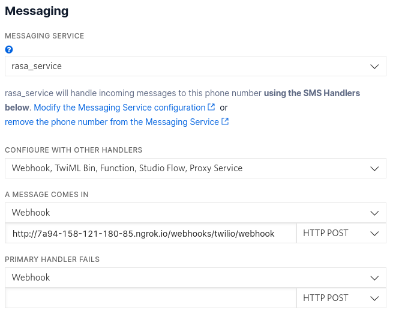

# rasa-proj

## SETUP
install rasa
run rasa init in a directory
copy all of the raasa-proj files in that directory overwriting duplicates

## TASKS NEEDED TO RUN LOCALLY FOR TESTING SITE  
ngrok http 5005  
rasa run --enable-api --cors "*"  
rasa run actions  
python3 app.py  

## SETUP TWILLIO   
go to Phone Numbers -> Manage -> Active numbers  
if you have an active number click on it and scroll down to Messaging  
in the "A Message Comes In" box, enter the ngrok forwarding address + /webhooks/twilio/webhook as a HTTP POST  
  

## SITE USAGE  
Upon site start the refresh button must be pressed to initialize busy waiting for user input  
